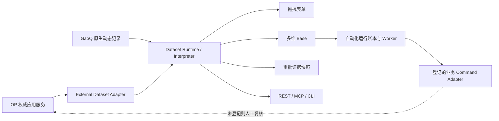

# GaoQ 业务运行时、流程表单与联邦多维数据交接

交接日期：2026-08-10（Asia/Shanghai）
适用对象：产品负责人、架构师、开发、SRE、安全评审人员和后续 AI 代理

> 本文不包含密码、Token、连接串或密钥。本文描述的是当前仓库实现状态；生产迁移
> 与部署状态必须以第 8 节及发布后追加的证据为准。禁止删除数据库、集合、索引、
> Redis、运行卷或同机其他项目。

## 1. 结论

人类架构师提到的 Interpreter 判断是正确的，但它不是一个把任意 JSON“翻译一下”
的单函数。生产可用的解释层必须同时约束 Schema 版本、来源、权限、类型、查询能力、
记录版本、证据快照和命令边界。本切片已经把这组能力实现为版本化 Dataset Runtime。

拖拽表单、多维 Base、审批、自动化、REST、MCP 和 CLI 现在共享同一套数据集语义。
OP 数据不复制进 GaoQ OS，也不允许动态运行时直连 OP 数据库；它由受控 Adapter
通过 OP 应用服务读取，OP 继续是唯一事实源。



## 2. 已实现能力

### 2.1 版本化 Dataset Runtime

- 原生引用：`kind=native + datasetId + schemaRevision`。
- 外部引用：`kind=external + system + objectType + schemaVersion`。
- 记录引用额外绑定 `recordId + version`，拒绝来源、Schema 或版本漂移。
- Adapter 返回的 Schema 和记录都经过严格普通对象、字段类型、时间、字段白名单和
  来源反向绑定。
- 通用运行时永久排除 `dedicated_only` 字段；当前 L3/L4 字段不进入通用投影。
- 查询只支持 Adapter 声明的能力；当前仅提供有界等值精确查询，不接受任意表达式、
  动态操作符或 URL。

### 2.2 OP 数据直接引用

首个外部数据集为 `op / operating_summary / 1.0`。表单或 Base 保存的是 OP 记录
引用，不是数据副本。展示时通过 OP 应用服务读取；提交审批时重新解析指定版本，
固定允许字段、来源版本、观察时间和 SHA-256 内容摘要。

这意味着实时页面能看到权威数据，而已发生的审批仍能证明“当时依据的事实”。若
OP 记录版本已经变化，旧引用不会静默读成新值，而是明确返回版本冲突。

### 2.3 拖拽表单与审批

- 新增 `dataset_reference` 字段类型，可在属性面板选择数据集、显示字段和审批快照字段。
- 发布表单前，服务端校验数据集存在、版本精确、字段可通用读取且当前主体具备来源 Scope。
- 外部引用、关联和派生字段不能直接成为客户端条件表达式，避免用实时外部值静默改变
  已发布流程。
- 服务端把动态表单编译为版本化审批模板；模板发布后再次同步会创建下一修订，不改写
  已发布模板。
- 表单记录提交审批时，以同一应用事务创建并提交审批实例，绑定表单修订、记录版本和
  外部证据快照。

### 2.4 多维 Base

- Base 同时支持原生 Table 与只读 External Table。
- Grid 使用 Dataset Runtime 读取 Schema 与记录；外部表不伪装为可写表。
- 外部精确查询使用声明字段和固定 `eq` 操作符，最大返回 100 条。
- MCP 的 Base 目录已兼容两类 Table，不暴露自动化动作、筛选值或成员权限。

### 2.5 自动化运行时

- 原生记录创建/更新与 Outbox 同事务生成不可变执行计划。
- `base_automation_runs` 保存计划摘要、来源记录版本、执行进度、最小结果引用与稳定
  失败码；同一自动化和来源版本不能被改写成另一计划。
- Worker 使用逐动作幂等键，可发起动态表单审批、创建原生记录和更新来源记录。
- 更新来源记录必须是最后一个动作；由自动化写出的记录在 v1 不继续级联自动化，防止环路。
- 通知与 `connector_call` 当前在任何副作用前进入 `manual_review`。正式通知、OP
  Command 契约、凭据和适配器未登记前，系统不会模拟成功或直接写外部数据库。
- 运行状态可通过 `GET /api/multidimensional-bases/{baseId}/automation-runs/{runId}`
  读取，返回控制面状态，不返回记录正文。

### 2.6 REST、MCP 与 CLI

REST 数据集入口包括目录、按版本解析、证据快照和精确查询；动态表单新增审批模板同步、
记录提交审批；Base 新增自动化运行状态读取。OpenAPI 已重新生成。

MCP 新增两个只读 R0 Tool：

- `dataset_catalog`
- `dataset_record_resolve`

当前目录为 56 Tool、4 Resource、27 Resource Template、25 Prompt。MCP 只复用应用
服务，不直连数据库、不获取 OP Token，也不提供数据集 Command Tool。

CLI 新增：

```bash
pnpm forms:cli -- bases list
pnpm forms:cli -- datasets list
pnpm forms:cli -- datasets resolve --file ./dataset-request.json
```

CLI 只从环境读取短时 Token，不接受命令行 Token，不直连数据库。

## 3. 关键代码

| 范围 | 路径 |
|---|---|
| 数据集引用与解释器 | `apps/erp-api/src/modules/dynamic-form/domain/dataset-reference.ts`、`dataset-runtime.ts` |
| 统一运行时应用服务 | `apps/erp-api/src/modules/dynamic-form/runtime/dataset-runtime.service.ts` |
| 原生/OP Adapter | `apps/erp-api/src/modules/dynamic-form/runtime/*dataset.adapter.ts` |
| 外部引用与证据快照 | `apps/erp-api/src/modules/dynamic-form/runtime/external-dataset-reference.service.ts` |
| 表单到审批编译 | `apps/erp-api/src/modules/dynamic-form/domain/dynamic-form-approval.ts` |
| 审批桥接 | `apps/erp-api/src/modules/dynamic-form/application/dynamic-form-approval-bridge.service.ts` |
| 自动化解释器 | `apps/erp-api/src/modules/dynamic-form/domain/base-automation-interpreter.ts` |
| 自动化账本与 Worker | `apps/erp-api/src/modules/dynamic-form/persistence/base-automation-run.*`、`base-automation.processor.ts` |
| 表单与 Base 界面 | `apps/erp-web/app/workspace/forms`、`apps/erp-web/app/workspace/bases` |
| MCP | `apps/erp-api/src/modules/mcp/mcp-runtime.service.ts`、`mcp-tool.service.ts` |
| CLI | `scripts/dynamic-form-cli.mjs` |
| 架构决策 | `docs/adr/0007-business-runtime-and-federated-datasets.md` |

## 4. 数据与迁移

新增集合：`base_automation_runs`。其内容仅为自动化控制面，不保存动态记录值、外部
业务正文、凭据或上游异常正文。

迁移入口：

```bash
pnpm --filter @gaoq/erp-api build
MONGODB_URI='<由服务器秘密环境注入>' \
  pnpm --filter @gaoq/erp-api migrate:phase6:dynamic-data-platform-indexes -- --dry-run
```

迁移 ID 为 `phase-6-dynamic-data-platform-indexes-v2`，覆盖五个动态数据基础设施集合。
它只允许追加缺失索引，不允许删除或重建集合/索引。先 dry-run、备份与人工审查，再
单独批准 apply；应用回滚不得删除新集合或其数据。

## 5. 权限与秘密

既有最小 Scope：

- `erp:forms:definition:design/publish`
- `erp:forms:data:read/write`
- `erp:bases:workspace:read/design`
- `erp:approval:instance:submit`

新增自动化服务主体专用 Scope：`erp:approval:dynamic_form:automate`。OP 引用当前复用
受控读取 Scope `erp:op:operating_summary:read`。不得把这些 Scope 通过客户端请求体
或自定义 Header 注入。

记录写入仍要求独立 `FORM_DATA_ENCRYPTION_KEYS`。OP Command、通知与其他 Connector
必须各自登记固定 Origin、操作、凭据命名空间、幂等语义和返回 Schema；不得复用
数据库连接串或把 Token 交给动态运行时。

## 6. 已完成验证

- Dataset Runtime 与自动化账本最终增量定向：2 个文件、12 项测试通过；
  ERP API 全量：462 个文件、7,298 项测试通过。
- 全仓 `pnpm check` 通过；ERP API 全局覆盖率为 Statements 90.08%、
  Branches 87.92%、Functions 88.84%、Lines 92.14%。
- ERP Web：16 个文件、94 项测试通过；TypeScript 与生产构建通过。
- ERP API TypeScript 与生产构建通过。
- 动态数据 v2 迁移清单测试 2 项通过，未连接数据库、未执行 apply。
- MCP 目录门禁通过，官方 HTTP/stdio 协议测试已包含 56 Tool。
- OpenAPI 已生成：53 个 Controller、272 个路由声明、278 个操作、123 个 DTO Schema；
  AsyncAPI 189 个事件校验通过。
- CLI 语法、帮助和参数入口通过。

这些仓库证据不替代生产 Replica Set、Redis、密钥、索引、OP 实体接口、浏览器、
实体 MCP 客户端、安全、性能与业务 UAT。

## 7. 当前明确不具备的能力

- 不是飞书多维表格的全部功能复刻；公式依赖图、聚合、完整视图渲染、行列权限和
  大表查询索引仍需继续建设。
- 尚无正式通知 Adapter，也未登记任何 OP 写 Command；相关动作只会人工复核。
- 外部 Table 当前只读；系统不支持任意外部 Schema、任意 URL 或任意字段写回。
- 尚未完成 OP 经营摘要以外的专业系统 Adapter；专业算薪 L4 明细不得直接进入
  通用 Dataset Runtime。

## 8. 发布状态与安全边界

截至本文最后一次验证：仓库实现与本地门禁已完成；生产数据库未连接，v2 迁移未 dry-run、
未 apply，生产应用未部署。后续发布必须把最终 commit、镜像摘要、发布目录、健康检查、迁移 dry-run
摘要与回滚文件补入本文和 HTML 版本后，才能声称已上线。

只允许定向更新 GaoQ OS API、Worker 和 ERP Web。不得重启、覆盖或删除 CMS、专业
算薪、同机其他 Compose Project、MongoDB、Redis、配置和代码。回滚只回退三项应用
镜像/运行配置，并保留新增集合、索引和所有业务数据；禁止 `docker compose down -v`。

## 9. 人类与外部配置待办

### P0：启用生产前

1. 由数据/SRE 审核 v2 dry-run、备份和维护窗口，再明确批准追加索引 apply。
2. 由 KMS/Secret Manager 配置并演练独立 `FORM_DATA_ENCRYPTION_KEYS`。
3. 注册并分配自动化服务主体 Scope，完成发布者、表单提交人和自动化主体职责矩阵 UAT。
4. OP 团队确认经营摘要 `1.0` 的字段、版本冲突、查询上限和可用性 SLO。
5. 完成表单外部引用、审批证据快照、自动化幂等/重试/人工复核和回滚 UAT。

### P1：启用外部副作用前

1. 通知团队提供固定模板注册表、收件人解析规则、网关契约和独立凭据。
2. OP 团队逐个提供允许的 Command 名称、固定端点、请求/响应 Schema、幂等键、
   权限、超时、结果不确定处置和事件回执；禁止提供通用“执行任意操作”接口。
3. 为每个 Connector 完成 SSRF、重定向、正文上限、严格 UTF-8/JSON、非 2xx 不读
   正文、稳定错误码和人工对账验收。
4. 用计划支持的 MCP/CLI 实体客户端重新发现 56 Tool；旧 54 Tool 证据失效。

## 10. 后续 AI 接手顺序

1. 先读根 `AGENTS.md`、`CODEX.md`、本文件和 ADR-0007；先检查工作区，保留用户改动。
2. 任何生产动作前核对最终 commit、目标 Compose Project、三项目标服务和回滚文件；
   不得把其他项目纳入命令范围。
3. 先运行仓库门禁，再对生产执行只读盘点与迁移 dry-run；apply 必须有独立明确批准。
4. 新增数据源时实现窄 Adapter，并分别测试 Schema、记录、租户、版本、字段和权限错位；
   禁止把数据库 Repository 暴露给运行时。
5. 新增 Command 时必须使用固定契约、可靠账本和人工复核，不得给 MCP 注册直接外部
   写入 Tool。
6. 每个切片同步 REST、事件、MCP/CLI、审计、迁移、UAT 与交接材料，明确区分
   “代码已交付”“生产已部署”和“外部已验收”。
