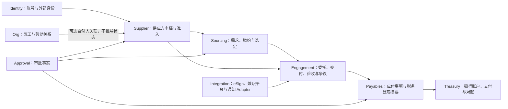

# GaoQ OS 供应方管理体系蓝图

## 1. 结论与当前边界

GaoQ 的供应方体系不能照搬传统“企业供应商主数据 + 采购订单”，也不能直接搬入
`creator-service-part-time` 的“创作者账号 + 抢单 + 钱包”模型。目标模型同时支持：

- 自然人兼职者本人签约、履约并依法收款；
- 个体工商户、工作室、公司或代理机构签约，由一个或多个自然人履约；
- 同一自然人在员工、候选人、供应方履约者之间存在明确、互不推导权限的多重关系；
- 公开邀约、定向询价、框架价和直接委托等不同寻源方式；
- 准入、合同、交付、验收、应付、税务与支付证据可追溯，但分别由正确领域拥有。

本文冻结领域词汇、模块接口、数据归属、状态机、首期范围和未来整合方式。仓库已
交付 Supplier、Sourcing、Engagement、Payables 的纵向切片，管理端供应方、寻源、
履约与结算页面，供应方本人门户，资格到期 Worker，追加式索引迁移，以及 REST、
CloudEvents、Supplier 只读 MCP 契约。组织供应方成员授权、本人机会响应、交付与
收入投影也已闭环；电子签与 Treasury 采用独立脱敏事务 Outbox 意图，受控回执再
推进业务终态。这只代表仓库实现；真实技术厂商账号、合同模板/收款配置、外部兼职
平台整合、法务/财务/安全 UAT 和生产发布仍未完成。

## 2. 参考项目盘点与取舍

参考目录：`/Users/gilberthomemacmini/Projects/creator-service-part-time`。

| 参考能力 | 业务语义 | GaoQ OS 归属 | 处理方式 |
| --- | --- | --- | --- |
| `csp_users`、实名 | 创作者身份和准入 | Supplier + Identity | 迁移为供应主体/关系/外部身份引用；高敏身份重新核验或走受控密钥迁移 |
| `csp_user_skills` | 服务技能 | Supplier | 映射为版本化服务能力，使用标准分类而非任意角色 |
| `csp_quotes` | 参考报价 | Supplier | 映射为价目项；金额转换为整数分字符串并保留币种、单位、有效期 |
| `csp_requirements` | 服务需求发布 | Sourcing | 映射为寻源需求与邀约；预算不是成交价 |
| `csp_orders` | 抢单、交付、验收 | Engagement | 拆成选定证据、履约委托、交付项和验收记录 |
| `csp_contracts` | 电子签流程 | Integration/eSign | 仅迁移合同与签署证据引用，不迁移回调原文或长期签署链接 |
| `csp_wallets`、`csp_transactions` | 平台余额和流水 | Payables | 只作为迁移对账来源；不得把余额直接写成 ERP 财务事实 |
| `csp_withdrawals` | 提现与打款 | Payables + Treasury | 映射应付/支付状态并逐笔对账，不沿用旧转账凭据 |
| 邀请奖励 | 获客激励 | Marketing/Payables | 独立于供应方等级，不影响准入和能力评价 |
| 通知记录 | 消息投递 | Integration | 仅迁移必要审计摘要，不迁移通知正文和渠道凭据 |

参考项目可保留的产品经验是移动端自助入驻、技能与价目维护、需求大厅、交付和收入
可见性；不可继承的实现包括无租户集合、角色式身份、`number` 金额、共享钱包事实、
原始技术厂商响应落库和登录令牌互信。

## 3. 领域地图与数据所有权



| 领域 | 拥有 | 只引用 | 明确不拥有 |
| --- | --- | --- | --- |
| Supplier | 供应关系、准入档案、能力、价目项、关系负责人 | `identityId/personId`、审批、税务/收款配置摘要 | 登录凭据、劳动关系、合同文件、银行账户明文、支付流水 |
| Sourcing | 需求、邀约、供应响应、选定决定 | 供应关系、预算审批 | 供应方主档、合同、交付、应付 |
| Engagement | 履约委托、履约者安排、交付版本、验收、争议 | 选定证据、供应关系、合同证据 | 供应方准入原文、银行账户、支付执行 |
| Payables | 应付事项、扣税/凭证要求摘要、支付指令引用、对账结果 | 验收、审批、Treasury 回执 | 钱包、银行凭据、外部支付 Token |
| Integration | 外部标识映射、Inbox/Outbox、Adapter 运行状态 | 各领域公开应用接口 | 供应关系、委托和财务终态 |

## 4. 核心模型

### 4.1 Supplier 聚合

`SupplierRelationship` 是 Supplier 领域的聚合根，而不是 `User`。建议最小结构：

```typescript
interface SupplierRelationship {
  supplierId: string;
  tenantId: string;
  supplierNumber: string;
  party: {
    kind: 'individual' | 'organization';
    partyRef: string;
  };
  legalForm: 'individual' | 'sole_proprietor' | 'studio' | 'company' | 'agency';
  status: 'draft' | 'under_review' | 'active' | 'suspended' | 'closed' | 'rejected';
  riskTier: 'low' | 'medium' | 'high';
  ownerEmployeeId: string;
  qualificationRevision: number;
  version: number;
}
```

辅助记录：

- `SupplierPartyProfile`：显示名、法定名称密文、自然人或组织核验引用；
- `SupplierQualification`：核验类型、结论、适用范围、签发/到期时间、证据引用；
- `SupplierCapability`：标准服务分类、等级、地域/渠道范围、证明和有效期；
- `SupplierRateItem`：服务分类、计价单位、金额、币种、税含义、最小量和有效期；
- `SupplierMemberRelationship`：组织供应方与履约自然人的授权关系和有效期；
- `SupplierExternalMapping`：旧平台/第三方的加密外部标识与盲索引，由 Integration 拥有。

关键约束：

1. 同租户 `supplierNumber` 唯一，所有索引以 `tenantId` 开头。
2. 自然人和组织使用不同的准入矩阵；组织供应方不能把联系人当作法定主体。
3. `active` 必须有当前有效的身份/主体核验、合作条款接受、服务范围和所需审批。
4. 任何强制资质过期、撤销或风险冻结都会使新增寻源选定失败；既有委托进入显式复核，不静默取消。
5. `suspended/closed/rejected` 不能创建新委托；历史合同、交付和财务事实保留。
6. 供应方登录账号是可选的 Identity 关联；没有账号也可以存在供应关系。
7. 价目项不是成交金额，不得直接产生应付事项。

### 4.2 自然人与组织的关系

| 场景 | 供应主体 | 履约者 | 收款对象 | 要求 |
| --- | --- | --- | --- | --- |
| 个人兼职者本人接单 | 自然人 | 同一自然人 | 同一自然人 | 实名、用工分类、税务与收款核验 |
| 个体户/工作室本人履约 | 个体户/工作室 | 经营者或授权成员 | 个体户/工作室 | 登记主体与经营者关系核验 |
| 公司派设计师 | 公司 | 一个或多个自然人 | 公司 | 公司准入 + 履约者授权，不向个人支付 |
| 代理机构转包 | 代理机构 | 经批准的下游履约者 | 代理机构 | 合同允许转包、下游主体可追溯 |
| 在职员工兼任供应方履约者 | 供应主体按合同决定 | 该自然人 | 按供应主体 | 利益冲突、用工分类和独立审批；员工权限不继承 |

### 4.3 状态机

供应关系：

```text
draft → under_review → active ↔ suspended → closed
                  └→ rejected
```

- `draft → under_review`：精确资料集、隐私告知与幂等键齐全；
- `under_review → active`：准入矩阵全部通过且审批证据有效；
- `active → suspended`：资质过期、合规冻结、争议风险或人工停用；
- `suspended → active`：原冻结原因关闭并形成新审批证据；
- `closed/rejected` 为终态，重新合作创建新的供应关系版本，不复活历史终态。

寻源需求：

```text
draft → pending_approval → published → evaluating → awarded → closed
   └───────────────→ cancelled      └──────────────→ cancelled
```

履约委托：

```text
draft → pending_approval → pending_signature → active → delivered → accepted
   └───────────────→ cancelled                         └→ disputed
```

应付事项从 `accepted` 事件幂等创建，独立按
`prepared → pending_approval → approved → submitted → paid|failed|frozen` 推进。履约
状态不得因支付失败回退，支付终态也不得伪造验收事实。

## 5. 深模块接口

接入层不应理解准入矩阵、个体/组织差异或跨域证据组合。首期保留三个外部 seam：

```typescript
interface SupplierCommandModule {
  createDraft(command: CreateSupplierDraft, actor: ActorContext): Promise<SupplierSummary>;
  submit(command: SubmitSupplier, actor: ActorContext): Promise<SupplierSummary>;
  decide(command: DecideSupplier, actor: ActorContext): Promise<SupplierSummary>;
  changeStatus(command: ChangeSupplierStatus, actor: ActorContext): Promise<SupplierSummary>;
}

interface SupplierQueryModule {
  get(ref: SupplierRef, actor: ActorContext): Promise<SupplierProjection>;
  search(query: SupplierSearch, actor: ActorContext): Promise<SupplierPage>;
}

interface SupplierEligibilityModule {
  resolve(input: EligibilityRequest, actor: ActorContext): Promise<EligibilitySnapshot>;
}
```

`SupplierEligibilityModule.resolve` 是 Sourcing、Engagement、Approval 和未来兼职平台
Adapter 的唯一准入 seam：它返回冻结的资格快照、原因码和摘要，不暴露证件、银行、
税务或审批原文。若删除该模块，个体/组织准入矩阵、资质时效、停用和利益冲突规则
会散落到多个调用方，因此该模块必须保持深接口。

Repository、加密、审批解析、风险策略和分类目录只作为 Supplier 实现内部 seam，
不得直接暴露给 REST、MCP、Worker 或其他领域。

## 6. REST、事件与 MCP 契约草案

### 6.1 REST

首期管理端：

- `POST /suppliers`：创建草稿，R1，强 `Idempotency-Key`；
- `GET /suppliers`、`GET /suppliers/:id`：按服务、状态、负责人和风险等级分页查询；
- `PUT /suppliers/:id/draft`：只更新草稿，强 `If-Match`；
- `POST /suppliers/:id/submit`：严格空正文，强 `If-Match` 与幂等键；
- `POST /suppliers/:id/decisions`：批准/拒绝，R2，引用独立审批事实；
- `POST /suppliers/:id/suspend|reactivate|close`：R2，原因使用白名单编码；
- `PUT /suppliers/:id/capabilities`、`PUT /suppliers/:id/rates`：版本化全量替换。

个人供应方自助端只能经本人委托令牌更新自己的草稿、能力和价目；法定身份、税务、
收款配置改动必须走独立强认证和审批，不允许客户端直接上报“已认证/已通过”。

本人端使用服务端从可信 Actor 解析的 `SupplierMemberRelationship`，请求中不接受
`supplierId` 回退。当前已交付 `/supplier-self/profile`、`/opportunities`、
`/engagements`、`/income` 及响应/交付入口；收入只返回应付最小投影，不返回
Treasury 指令、税务证据或银行信息。管理端另有供应方成员授权与撤销入口。
每个有效成员至少具备 `profile_read`；履约者另必须具备 `delivery_submit`，
且永久禁止目录管理、响应提交和收入读取。本人门户依访问令牌 Scope 分区
加载，一个可选区域无权或暂时失败不会导致整页履约功能不可用。

### 6.2 CloudEvents

首期事件：

- `supplier.relationship.created|submitted|activated|rejected|suspended|reactivated|closed` v1；
- `supplier.capabilities.updated` v1；
- `supplier.rates.updated` v1；
- `supplier.qualification.expiring|expired` v1；由 Worker 扫描受信任投影并在事务内
  推进资格状态与 Outbox；
- `supplier.member.authorized|revoked` v1；
- `engagement.signature.requested` v1：只携带委托、供应方、金额和审批证据引用；
- `payables.treasury.materialization_requested` v1：只携带应付控制量和不透明证据引用。

事件只包含租户、供应方 ID、版本、状态、服务分类编码、原因码和资格摘要，不包含
姓名、证件、联系方式、账户、税务正文、合同或自由文本。

### 6.3 MCP

首期只读 R0：

- `supplier_search`：在授权范围内返回脱敏供应方摘要；
- `supplier_profile_get`：返回状态、能力、价目区间和资格结论；
- `supplier_eligibility_check`：只返回某用途是否可合作及稳定原因码。

以下能力不注册标准 MCP 写 Tool：准入批准/拒绝、实名或资质核验、法定身份和银行
账户修改、合同签署、税务正文、支付、争议裁决、删除/匿名化、外部平台重放和人工
处置。若后续开放草稿维护，必须使用 R1 `prepare/execute` 并只接收服务端加密草稿
引用。

## 7. 安全、隐私与合规门禁

### 7.1 数据分级

| 数据 | 等级 | 控制 |
| --- | --- | --- |
| 公开服务分类、脱敏能力摘要 | L1/L2 | 租户和授权范围 |
| 联系方式、个人作品、评价、履约者关系 | L3 | 字段加密、目的限制、访问审计 |
| 法定姓名、证件、税号、银行账户、合同、税务凭证 | L4 | KMS 信封加密、独立盲索引、强认证、最小投影 |

### 7.2 必须失败关闭的规则

1. `tenantId` 只来自验证后的用户/服务身份；任何 Header、表单或外部事件自报租户均拒绝。
2. 供应方自然人去重只能使用独立密钥域的规范化盲索引；不得索引姓名、证件明文或随机密文。
3. 金额跨边界使用十进制整数分字符串，领域使用 BigInt；不得沿用参考项目的元 `number`。
4. 银行账户由 Treasury 专用能力拥有；Supplier 只能保存不可解释引用和核验状态。
5. 技术厂商回调先验签、限长、入 Inbox，再由 Worker 投影；未知或冲突终态进入人工复核。
6. 事务内提交聚合、Outbox 和幂等记录；提交后审计故障只能稳定告警，不得回滚已完成业务或诱发重放。
7. 读取必须反向绑定租户、查询主键、状态、版本、引用闭包和时间；不能只信任 Mongo 查询条件或 TypeScript 类型。
8. 个人供应方必须有收集目的、授权/适用依据、保留期、撤回和到期清理；法务结论未签署前不得生产启用。

### 7.3 特有风险场景

- **事实劳动关系误判**：长期固定工时、强管理、单一收入依赖等条件触发人工用工分类复核，系统不得自动把“签了服务合同”视为合规结论。
- **员工利益冲突**：`personId` 与活动 `Employment` 命中时要求独立审批和职责隔离，禁止审批本人或关联供应方。
- **组织冒用个人履约**：组织供应方提交的履约者必须存在有效成员授权，且付款对象保持供应主体。
- **收款账户替换欺诈**：账户变更强认证、双人审批并设置冷静期；已批准应付使用冻结账户引用快照。
- **资质过期竞态**：选定和委托激活时重新解析资格；不能只信任创建需求时的旧快照。
- **重复抢单/双重选定**：以事务 CAS + 唯一选定约束为准，Redis 锁只优化并发，不作为事实。

## 8. 未来整合 `creator-service-part-time`

### 8.1 整合原则

1. GaoQ OS Supplier 在切换后是供应方主档唯一事实源；参考平台不得反向覆盖准入终态。
2. 两个系统不共享 MongoDB、Redis、JWT、KMS 密钥、管理员账号或内部 Token。
3. 先登记 `sourceSystem + tenantId + externalId` 映射，再迁移业务事实；外部 ID 不进入核心聚合。
4. 迁移采用导出包 + Schema 校验 + 摘要 + 拒绝清单，不直接跨库读取生产集合。
5. 迁移前冻结旧端新注册/改价/接单写入；如果需要过渡双写，只由可靠 Outbox/Inbox 驱动并逐项对账。
6. 旧平台资金余额、流水、提现和合同逐笔与财务/eSign 证据对账，不能凭集合总数迁移。
7. 原 AES-CBC 实名密文不直接复制到新库；优先重新核验，确需迁移时由安全批准的离线流程解密后立即按新密钥域重加密，不保存中间明文。

### 8.2 过渡阶段

| 阶段 | GaoQ OS | 参考平台 | 退出条件 |
| --- | --- | --- | --- |
| A 盘点 | 建立分类、准入和映射契约 | 继续生产事实源 | 字段映射、数量、金额、证据和拒绝规则签署 |
| B 影子 | 只读投影并计算资格差异 | 继续写入 | 连续四周身份/状态/能力差异为零或已解释 |
| C 冻结迁移 | 接收最终全量与增量 | 冻结高风险写入 | 供应方、委托、合同、余额、提现逐项对账 |
| D 切换 | 成为主档与业务入口 | 只读查询 | 身份、权限、事件、资金和回滚 UAT 通过 |
| E 归档 | 保留受控历史引用 | 下线写服务 | 法务、财务、数据和安全批准归档/删除 |

## 9. 分阶段实施计划

### Phase S0：架构与治理

- [x] 统一领域词汇并解决“业务供应方/技术厂商”歧义；
- [x] 冻结四领域数据所有权、状态机和深模块 seam；
- [x] 提出 ADR-0009；
- [x] 完成参考项目能力映射和迁移红线；
- [ ] 业务、法务、财务、安全共同确认个人兼职者准入矩阵和用工分类规则；
- [ ] 建立数据处理活动、威胁模型、角色矩阵和保留策略条目。

### Phase S1：供应方主档与准入

- [x] Supplier 领域、Repository、L4 身份加密、独立盲索引与 Outbox；
- [x] 管理端列表、详情、草稿、提交、审批、暂停、能力与价目维护；
- [x] 个人与组织两套准入矩阵及实时资格解析 seam；
- [x] REST/OpenAPI、CloudEvents/AsyncAPI、三项只读 MCP 契约；
- [x] 追加式 Supplier 索引迁移与 dry-run；
- [x] 资格到期 Worker、本人委托令牌门户与浏览器响应契约；
- [x] 全生产源码纳入仓库四维 80% 总门禁；eSign/Treasury 脱敏事务 Outbox 边界
  另执行逐文件四维 90% 专项目标。

### Phase S2：能力目录与寻源

- [x] 服务能力、价目项、需求、邀请、响应、评估与选定；
- [x] 响应和选定前实时调用 `SupplierEligibilityModule`；
- [x] CAS 并发选定、预算上限、参考价与成交价分离；
- [x] ERP Web 寻源管理端桌面与移动布局；
- [x] 供应方本人机会大厅与响应入口；
- [ ] 预算审批真实适配器及业务 UAT。

### Phase S3：履约与应付

- [x] 从已选定寻源创建履约委托，支持审批、签署证据、交付版本、验收和争议；
- [x] 仅从可信验收终态幂等生成应付事项，金额使用 BigInt 语义的整数分字符串；
- [x] 应付审批、Treasury 不透明指令绑定、支付终态与对账证据引用；
- [x] 不建立可提现“钱包”；
- [x] 组织供应方履约成员授权注册表、本人交付与收入投影页面；
- [x] 管理端履约/结算工作台及 eSign/Treasury 独立脱敏事务意图契约；
- [ ] 真实 eSign/Treasury 技术厂商配置、端到端回执联调和财务 UAT。

### Phase S4：兼职平台整合

- 受控导出 Adapter、外部标识映射和影子差异报告；
- 三次迁移演练、资金/合同逐笔对账、回滚演练；
- 门户能力迁移、旧平台只读归档和四周 Hypercare。

## 10. S1 验收清单

- [ ] 个人、个体/工作室、公司/代理三类供应主体可建档且使用不同准入矩阵；
- [ ] 供应主体、履约者、账号和劳动关系可以分别存在且不会互相推导权限；
- [ ] 跨租户读取/写入、客户端自报租户、未知字段、弱 `If-Match` 和重复幂等键全部失败关闭；
- [ ] L3/L4 字段密文、盲索引、密钥命名空间、脱敏投影和访问审计通过安全测试；
- [ ] 激活、暂停、恢复、关闭及资格过期状态矩阵完整，受损持久化记录读取失败关闭；
- [ ] REST、事件、MCP 逐字契约一致，MCP 不暴露高敏正文或高风险写能力；
- [ ] Mongo 事务、Outbox、审计提交后故障和 Worker 重试不会重复业务副作用；
- [ ] 索引迁移只追加、支持 dry-run、未获批准不执行生产写入；
- [ ] 本地质量门禁通过，同时明确真实法务/财务/安全 UAT 和外部联调未完成。
